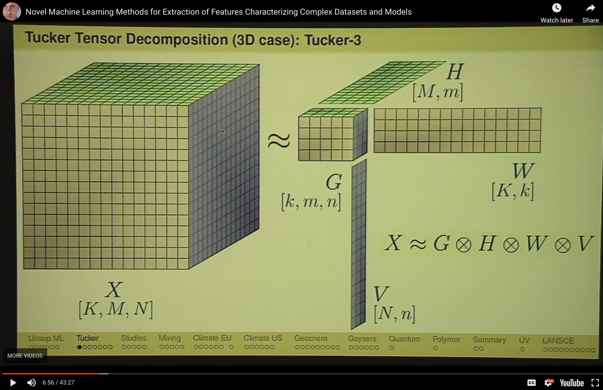

NTFk: Nonnegative Tensor Factorization using k-means clustering
================

<div style="text-align: left">
    
</div>

### Installation

After starting Julia, execute:

```julia
import Pkg
Pkg.add(Pkg.PackageSpec(url="https://github.com/TensorDecompositions/NMFk.jl.git", rev="master"))
Pkg.add(Pkg.PackageSpec(url="https://github.com/TensorDecompositions/CanDecomp.jl.git", rev="master"))
Pkg.add(Pkg.PackageSpec(url="https://github.com/TensorDecompositions/LoadTensorDecompositions.jl.git", rev="master"))
Pkg.add(Pkg.PackageSpec(url="https://github.com/TensorDecompositions/TensorDecompositions2.jl.git", rev="master"))
Pkg.add(Pkg.PackageSpec(url="https://github.com/TensorDecompositions/NTFk.jl.git", rev="master"))
```

or

```julia
import Pkg;
Pkg.develop(Pkg.PackageSpec(url="https://github.com/TensorDecompositions/NMFk.jl.git"))
Pkg.develop(Pkg.PackageSpec(url="https://github.com/TensorDecompositions/CanDecomp.jl.git"))
Pkg.develop(Pkg.PackageSpec(url="https://github.com/TensorDecompositions/LoadTensorDecompositions.jl.git"))
Pkg.develop(Pkg.PackageSpec(url="https://github.com/TensorDecompositions/TensorDecompositions2.jl.git"))
Pkg.develop(Pkg.PackageSpec(url="https://github.com/TensorDecompositions/NTFk.jl.git"))
```

### Testing

```julia
Pkg.test("NTFk")
```

### Tensor Decomposition

**NTFk** performs a novel unsupervised Machine Learning (ML) method based on Tensor Decomposition coupled with sparsity and nonnegativity constraints.

**NTFk** has been applied to extract the temporal and spatial footprints of the features in multi-dimensional datasets in the form of multi-way arrays or tensors.

**NTFk** executes the decomposition (factorization) of a given tensor  by minimization of the Frobenius norm:


<!-- X-G\otimes_1 A_1\otimes_2A_2\dots\otimes_nA_n_F^2 -->

where:

*  is the dimensionality of the tensor 
*  is a "mixing" core tensor
*  are "feature” factors (in the form of vectors or matrices)
*  is a tensor product applied to fold-in factors   in each of the tensor dimensions

<div style="text-align: center">
    
</div>

The product  is an estimate of  ().

The reconstruction error  is expected to be random uncorrelated noise.

 is a -dimensional tensor with a size and a rank lower than the size and the rank of .
The size of tensor  defines the number of extracted features (signals) in each of the tensor dimensions.

The factor matrices  represent the extracted features (signals) in each of the tensor dimensions.
The number of matrix columns equals the number of features in the respective tensor dimensions (if there is only 1 column, the particular factor is a vector).
The number of matrix rows in each factor (matrix)  equals the size of tensor X in the respective dimensions.

The elements of tensor  define how the features along each dimension () are mixed to represent the original tensor .

**NTFk** can perform Tensor Decomposition using [Candecomp/Parafac (CP)](https://en.wikipedia.org/wiki/Tensor_rank_decomposition) or [Tucker](https://en.wikipedia.org/wiki/Tucker_decomposition) decomposition models.

Some of the decomposition models can theoretically lead to unique solutions under specific, albeit rarely satisfied, noiseless conditions.
When these conditions are not satisfied, additional minimization constraints can assist the factorization.
A popular approach is to add sparsity and nonnegative constraints.
Sparsity constraints on the elements of G reduce the number of features and their mixing (by having as many zero entries as possible).
Nonnegativity enforces parts-based representation of the original data which also allows the Tensor Decomposition results for  and  to be easily interrelated [Cichocki et al, 2009](https://books.google.com/books?hl=en&lr=&id=KaxssMiWgswC&oi=fnd&pg=PR5&ots=Lta2adM6LV&sig=jNPDxjKlON1U3l46tZAYH92mvAE#v=onepage&q&f=false).

### Publications:

- Vesselinov, V.V., Mudunuru, M., Karra, S., O'Malley, D., Alexandrov, B.S., Unsupervised Machine Learning Based on Non-Negative Tensor Factorization for Analyzing Reactive-Mixing, Journal of Computational Physics, 2018 (in review). [PDF](http://monty.gitlab.io/papers/Vesselinov%20et%20al%202018%20Unsupervised%20Machine%20Learning%20Based%20on%20Non-Negative%20Tensor%20Factorization%20for%20Analyzing%20Reactive-Mixing.pdf)
- Vesselinov, V.V., Alexandrov, B.S., O'Malley, D., Nonnegative Tensor Factorization for Contaminant Source Identification, Journal of Contaminant Hydrology, 10.1016/j.jconhyd.2018.11.010, 2018. [PDF](http://monty.gitlab.io/papers/Vesselinov%20et%20al%202018%20Nonnegative%20Tensor%20Factorization%20for%20Contaminant%20Source%20Identification.pdf)

Research papers are also available at [Google Scholar](http://scholar.google.com/citations?user=sIFHVvwAAAAJ&hl=en), [ResearchGate](https://www.researchgate.net/profile/Velimir_Vesselinov) and [Academia.edu](https://lanl.academia.edu/monty)

### Presentations:

- Vesselinov, V.V., Novel Machine Learning Methods for Extraction of Features Characterizing Datasets and Models, AGU Fall meeting, Washington D.C., 2018. [PDF](http://monty.gitlab.io/presentations/Vesselinov%202018%20Novel%20Machine%20Learning%20Methods%20for%20Extraction%20of%20Features%20Characterizing%20Datasets%20and%20Models%20LA-UR-18-31366.pdf)
- Vesselinov, V.V., Novel Machine Learning Methods for Extraction of Features Characterizing Complex Datasets and Models, Recent Advances in Machine Learning and Computational Methods for Geoscience, Institute for Mathematics and its Applications, University of Minnesota, 2018. [PDF](http://monty.gitlab.io/presentations/Vesselinov%202018%20Novel%20Machine%20Learning%20Methods%20for%20Extraction%20of%20Features%20Characterizing%20Complex%20Datasets%20and%20Models%20LA-UR-18-30987.pdf)

Presentations are also available at [slideshare.net](https://www.slideshare.net/VelimirmontyVesselin), [ResearchGate](https://www.researchgate.net/profile/Velimir_Vesselinov) and [Academia.edu](https://lanl.academia.edu/monty)

### Videos:

- [Vesselinov, V.V., Novel Machine Learning Methods for Extraction of Features Characterizing Complex Datasets and Models, Recent Advances in Machine Learning and Computational Methods for Geoscience, Institute for Mathematics and its Applications, University of Minnesota, 2018.](https://youtu.be/xPOkeLMJywE)

[](https://www.youtube.com/embed/xPOkeLMJywE)

Videos are also available on [YouTube](href=https://www.youtube.com/watch?v=xPOkeLMJywE&list=PLpVcrIWNlP22LfyIu5MSZ7WHp7q0MNjsj)

For more information, visit [monty.gitlab.io](http://monty.gitlab.io)

Installation behind a firewall
------------------------------

Julia uses git for package management. Add in the `.gitconfig` file in your home directory:

```
[url "https://"]
        insteadOf = git://
```

or execute:

```
git config --global url."https://".insteadOf git://
```

Set proxies:

```
export ftp_proxy=http://proxyout.<your_site>:8080
export rsync_proxy=http://proxyout.<your_site>:8080
export http_proxy=http://proxyout.<your_site>:8080
export https_proxy=http://proxyout.<your_site>:8080
export no_proxy=.<your_site>
```

For example, if you are doing this at LANL, you will need to execute the
following lines in your bash command-line environment:

```
export ftp_proxy=http://proxyout.lanl.gov:8080
export rsync_proxy=http://proxyout.lanl.gov:8080
export http_proxy=http://proxyout.lanl.gov:8080
export https_proxy=http://proxyout.lanl.gov:8080
export no_proxy=.lanl.gov
```
